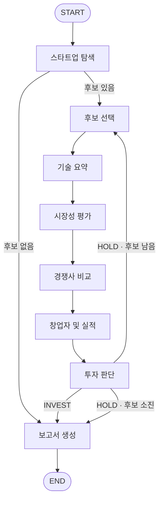

# AI Startup Investment Evaluation Agent (VentureSignal)

본 프로젝트는 반도체(저전력·고효율 AI 칩) 스타트업에 대한 투자 가능성을 자동으로 평가하는 에이전트를 설계하고 구현한 실습 프로젝트입니다.

## Overview

- Objective : 반도체 AI 스타트업의 기술력, 경쟁 우위, 시장성, 창업자, 실적 등을 기준으로 점수화해서 투자 적합성 분석

- Method : LangGraph 멀티 에이전트, Agentic RAG(하이브리드 검색), 웹서치(Tavily)

## Features

- PDF 자료 기반 정보 추출: 「국내외 AI 반도체 기업 통합 RAG 조사자료」 150쪽(50개 기업, 기술·시장 공통 주제 각 15개, 출처 90개)을 페이지 단위(청크 140개)로 색인해 검색
- 질의 조건(예: "국내", "상장사 제외")을 반영해 Top-3 후보 기업 탐색
- RAG와 웹서치로 기술·시장·경쟁·창업자·실적을 분석하고, 결과마다 출처(출처 ID·URL)를 남기며 확인되지 않은 정보는 추정하지 않음
- 분석과 채점 분리: 분석 에이전트는 근거만 수집하고, 투자 판단 에이전트만 Scorecard로 채점해 INVEST/HOLD 판정
- 평가표 (Score Table 방식)
    - 창업자(10%) - 분야 전문성, 이력
    - 시장성(15%) - 시장 규모, 성장 가능성
    - 제품/기술력(35%) - 성능, 완성도
    - 경쟁 우위(25%) - 독점적 자산, 모방 난도
    - 실적(10%) - 고객 확보, 매출
    - 투자조건(5%) - 다음 라운드까지의 런웨이 확보 가능성
    - 투자 여부를 판단하는 기준점은 실제 IPO에 성공한 기업의 점수
- 반도체 특화 Scorecard: 기술 복잡도가 높고, 설계 IP·공정 노하우 등 진입장벽이 높아 확보한 우위가 오래 유지되는 특성을 반영해 기술력(15→35%)·경쟁 우위(10→25%) 비중 상향
- HOLD면 다음 후보로 반복하고, 최종 결과를 SUMMARY~REFERENCE 양식의 투자 보고서로 생성

## Architecture



State 흐름: `query` → `candidates`(Top-3) → `current_candidate` → `evaluations`(기업별 분석·점수 누적, 덮어쓰지 않고 병합) → `report` (INVEST 기업은 `selected_candidate`에 기록)

## Tech Stack

- Framework : LangGraph 1.2.12, LangChain 1.4.3 (Python 3.11)
- LLM/Generator : OpenAI gpt-6-luna (분석·요약·보고서 생성)
- LLM/Judge : OpenAI gpt-6-luna (투자 판단 채점)
- Retrieval : Qdrant 로컬 모드 (bge-m3 Dense + Sparse 하이브리드, RRF) - 탐색 평가 30건 중 평균 23.2건 통과 (Top-3가 모두 정답 후보 5곳 안, 5회 평균)
- Embedding : BAAI/bge-m3 (오픈소스, MIT) — 한·영 혼용 문서 대응, Dense + Sparse 하이브리드를 한 모델로 지원, 최대 8,192 토큰, Multi-vector 확장성. 비교 후보 gte-multilingual-base보다 검색 품질을 우선해 선정
- Web Search : Tavily

## Agents

### 1. 스타트업 탐색 에이전트 (RAG)

질의에서 조건을 추출하고, 사전 구축한 조사자료 인덱스를 하이브리드 검색·재정렬해 Top-3 후보 기업을 찾는다.

- 사전 1회: `python -m rag.ingest`가 PDF를 페이지별로 읽어 메타데이터(회사, 기술/시장성, 국내/해외, 분야, 출처 번호)를 붙이고, bge-m3 의미 벡터(Dense, 1024차원)와 단어 벡터(Sparse, 전문용어 정확 일치)로 Qdrant에 저장 (출처 목록 10쪽은 별도 저장)
- ① 조건 추출(`query_parser.py`): LLM이 질의에서 "국내", "상장사 제외" 같은 조건 추출 (LLM 실패 시 규칙 기반 폴백)
- ② 검색(`retrieval.py`): 질의도 같은 방식으로 벡터화해 의미·단어 검색을 각각 수행하고, 두 순위표를 RRF로 결합
- ③ 재정렬(`ranking.py`): 조건에 맞지 않는 회사를 제외하고, 분야·기술 용어가 일치하면 가점 → Top-3
- 어기면 오답인 조건(상장 제외, 후기 투자 등)만 필터로 제거하고, 분야·용어 일치는 가점으로 반영 → 평가 30건 중 통과 8건(벡터 검색만) → 23~24건
- 검색 대상은 회사당 기술 페이지 1장(총 50장)이라 결과가 곧 회사 목록이며, "국내" 요구 시 검색 전에 국내 회사 8곳만 남김
- 기업 상태·탐색 태그는 PDF 본문에서 따로 읽어(`catalog.py`) 필터·점수에 사용하고, 상장·인수 기업은 질의가 비상장·독립을 요구할 때 제외

### 2. 후보 선택 (함수)

후보 목록에서 아직 평가하지 않은 후보 1곳을 꺼내 `current_candidate`로 지정하고 `candidate_index`를 1 증가시킨다.

### 3. 기술 요약 에이전트 (RAG + 웹서치)

후보 기업의 기술을 조사자료(PDF) 검색 → 1차 요약 → 웹서치 보강 → 출처 검수 순서로 분석해, 근거가 확인된 내용만 `technology`로 정리한다.

- 후보 기업의 `company_id`로 조사자료(PDF)의 기업 기술 페이지를 조회하고, 기술 공통 주제를 하이브리드 검색(bge-m3 Dense + Sparse)으로 보강
- 조사자료 기반 1차 요약으로 핵심 기술, 제품, 개발 단계, 성능·전력, 강점과 한계 정리
- 조사자료만으로 파악하기 어려운 양산·고객, SDK, 벤치마크 정보는 웹서치로 찾아 2차 요약에서 보강
- 출처 검수를 통해 실제 조회한 자료의 출처(source_id·URL)만 남기고, 출처 없는 수치와 검색 결과 본문에 없는 웹 수치는 제외
- 공개 사실, 회사 주장, 분석을 구분하고 웹에서 가져온 내용은 `web`으로 남김
- 미확인 정보는 추정하지 않고 추가 확인 항목(unverified)으로 분류하며, 근거가 없으면 근거 부족으로 반환

### 4. 시장성 평가 에이전트 (RAG + 필요 시 웹서치)

기업별 시장성 자료와 시장 공통 자료로 먼저 분석하고, 정보가 부족할 때만 웹서치로 보완해 `market`으로 정리한다.

- RAG 검색 범위: 기업별 시장성 페이지(`company_market`)와 시장 공통 주제(`market_topic`)
- 웹서치 대상: 시장 규모·성장 또는 고객 수요·도입 (기업당 목적별 최대 1회, 전체 최대 2회, 검색당 결과 3개)
- 정리 항목: 목표 고객, 시장 규모(범위·연도·단위·출처), 성장 요인, 수익 구조, 도입 장벽
- 성장 요인은 기업 매출 성장과 구분하며, 시장 성장만으로 기업 매출을 예측하지 않음
- 시장 규모 등 확인하지 못한 정보는 미확인으로 별도 기록

### 5. 경쟁사 비교 에이전트 (웹서치)

평가 기업 확인 → 웹 검색(최대 3회) → 경쟁 제품 비교 → 결과 제출 → 출처 URL 검증 순서로 진행하고, 검증을 통과한 결과만 `competition`으로 저장한다.

- 현재 평가 기업과 같은 고객 문제를 해결하는 경쟁 제품을 찾아 비교 (입력: `current_candidate`, `candidates`의 이름·설명·사업 분야)
- Tavily 웹서치, 검색당 최대 5개 결과
- 비교 항목: 제품의 용도·고객, 성능·전력, 가격·도입 조건, 강점·약점, 출처
- 근거 URL과 경쟁 제품 출처 URL이 실제 검색 결과에 있는지 검증. 실패 시 수정 또는 재검색(`recursion_limit=24`)하고, 끝까지 통과하지 못하면 저장하지 않고 오류 발생
- 비교 조건이 다르거나 확인되지 않은 정보는 우열로 단정하지 않고 별도 기록
- 출력 `details`: 경쟁사별 제품 정보(`peer_products`), 비교 조건, 미확인 정보, 핵심 위험 (`evidence`는 검색 결과 URL)

### 6. 창업자 및 실적 에이전트 (웹서치)

창업자·실적·투자조건을 웹에서 조사해 `team`·`traction`·`deal_terms`로 정리한다.

- 기업명과 CEO 이름을 기반으로 창업자 및 공동창업자 정보 탐색
- LinkedIn과 공식 웹 자료에서 학력, 경력, 전문성, 논문 및 제품 실행 경험 수집
- 고객, PoC, 계약, 매출 및 상용화 실적 분석
- 투자 유치 이력, 기업가치, 투자조건 및 런웨이 확인
- 원문 인용 검증을 통해 근거가 확인된 사실만 분석 결과에 반영
- 미확인 정보는 추정하지 않고 추가 확인 항목으로 분류

### 7. 투자 판단 에이전트 (LLM)

6개 분석 결과를 받아 LLM이 항목별 점수(0~5)와 근거만 산출하고, 가중합·판정은 코드(`scoring.build_scorecard` / `scoring.decide`)로 계산한다.

- 입력: 현재 후보의 분석 결과 6개 (`technology`, `market`, `competition`, `team`, `traction`, `deal_terms`)
- Scorecard 비중: 제품/기술력 35% · 경쟁 우위 25% · 시장성 15% · 창업자 10% · 실적 10% · 투자조건 5%
- 가중합을 0~100점으로 환산해 70점 이상이면 INVEST, 미만이면 HOLD
- INVEST면 `selected_candidate`에 기업 ID를 기록하고 보고서 생성으로 이동
- HOLD이고 후보가 남으면 다음 후보로 반복, 후보가 소진되면 보고서 생성으로 이동

### 8. 보고서 생성 에이전트 (LLM)

State 전체를 입력으로 설계 문서 E절 양식에 맞춘 마크다운 투자 보고서를 작성한다.

- 목차: SUMMARY → 사업 아이디어와 팀 → 실적·투자조건 → 시장·경쟁 → 기술력 → 리스크 → 종합 평가 → REFERENCE (양식: `agents/report_writer/template.md`)
- `evidence`의 출처 ID·URL로 출처 번호를 만들고 REFERENCE에 서지정보 기재
- 전 후보가 HOLD이면 보류 사유와 재검토 조건 포함

## Directory Structure

```
VentureSignal/
├── agents/                   # 에이전트별 폴더 (진입점: node.py 의 run(state))
│   ├── startup_search/       # 스타트업 탐색 (RAG)
│   ├── candidate_select/     # 후보 선택 (함수)
│   ├── tech_summary/         # 기술 요약 (RAG + 웹)
│   ├── market_eval/          # 시장성 평가 (RAG + 웹)
│   ├── competitor_compare/   # 경쟁사 비교 (웹)
│   ├── founder_traction/     # 창업자 및 실적 (웹)
│   ├── investment_decision/  # 투자 판단 (LLM, scoring.py)
│   └── report_writer/        # 보고서 생성 (LLM, template.md)
├── core/                     # 공용 State·LLM·설정
├── graph/                    # LangGraph 조립 (builder.py)
├── rag/                      # PDF 파싱·임베딩·Qdrant·검색
├── tools/                    # Tavily 웹검색
├── data/                     # 조사자료 PDF (index/ 는 로컬 생성)
├── docs/                     # 설계 문서
├── tests/                    # pytest
├── outputs/                  # 생성된 보고서
├── main.py                   # 실행 진입점
└── requirements.txt
```

## Contributors

- 임예리 : 스타트업 탐색 에이전트 (질의 조건 추출, 하이브리드 검색·RRF 결합, 조건 필터·재정렬)
- 김상현 : 기술 요약 에이전트 (RAG 기술 분석, 웹 보강, 출처 검수)
- 김영준 : 시장성 평가 에이전트 (RAG 시장 분석, 필요 시 웹 보완, 시장 규모·성장 요인 정리)
- 김재욱 : 경쟁사 비교 에이전트 (웹서치 경쟁 제품 비교, 출처 URL 검증)
- 황민진 : 창업자 및 실적 에이전트 (창업자 이력·실적·투자조건 조사, 원문 인용 검증)
