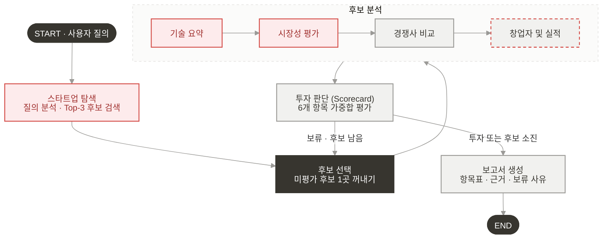

# VentureSignal — RAG 설계 산출물

> **울산캠퍼스 2반 2조** · 김상현, 김영준, 김재욱, 임예리, 황민진
>
> 반도체 AI 스타트업을 탐색·분석하고, Scorecard 기반으로 투자 여부를 판단해 보고서를 생성하는 LangGraph 멀티 에이전트 시스템

---

## 목차

- [A. Domain 선정](#a-domain-선정)
- [B. 설계](#b-설계)
  - [B-1. 에이전트 정의](#b-1-에이전트-정의)
  - [B-2. RAG 적용 대상](#b-2-rag-적용-대상)
  - [B-3. Embedding 모델 선정](#b-3-embedding-모델-선정)
- [C. 투자판단 기준](#c-투자판단-기준)
- [D. 그래프 설계(안)](#d-그래프-설계안)
  - [D-1. State 설계](#d-1-state-설계)
  - [D-2. Graph 흐름 설계](#d-2-graph-흐름-설계)
- [E. 투자 보고서 작성 양식](#e-투자-보고서-작성-양식)

---

## A. Domain 선정

| 항목 | 내용 |
|---|---|
| **도메인** | **Semiconductor** |
| **선정 이유** | AI 서비스 확산으로 전력·운영비 부담이 커지는 상황에서, 이를 줄일 수 있는 저전력·고효율 AI 칩 스타트업의 기술 경쟁력과 투자 가능성을 평가 |

---

## B. 설계

### B-1. 에이전트 정의

| 노드 | 구분 | 정의 | RAG |
|---|---|---|:---:|
| 🟥 **스타트업 탐색** | 에이전트 | 질의에서 도메인·투자 단계 조건을 추출하고 후보 기업 Top-3 검색 | O |
| ⬛ **후보 선택** | 함수 | 미평가 후보 1곳을 꺼내 현재 평가 대상으로 지정 | X |
| 🟥 **기술 요약** | 에이전트 | 핵심 기술, 제품, 개발 단계, 장단점 요약 | O |
| 🟥 **시장성 평가** | 에이전트 | 목표 세부 시장의 규모, 성장성, 수요 요인 분석 | O |
| ⬜ **경쟁사 비교** | 에이전트 | 경쟁사(피어 그룹) 탐색, 경쟁 구도와 차별성 분석 | X |
| ⬜ **창업자 및 실적** `신규` | 에이전트 | 창업팀 역량, 사업 실적, 투자 조건을 피어 그룹 대비로 분석 | X |
| ⬜ **투자 판단** | 에이전트 | Scorecard 6개 항목 채점, 가중합으로 투자 또는 보류 결정 | X |
| ⬜ **보고서 생성** | 에이전트 | 항목표, 근거, 보류 사유를 담은 투자 보고서 작성 | X |

> 🟥 RAG (사전 구축 DB) · ⬜ LLM · 웹서치 · ⬛ 일반 함수

**설계 원칙**

- **분석과 채점의 분리** — 분석 에이전트는 점수를 매기지 않고 *사실·근거·강점·위험요소*만 수집한다. 채점은 모든 분석이 끝난 뒤 **투자 판단** 노드에서 한 번만 수행해 평가 기준의 일관성을 확보한다.
- **`창업자 및 실적` 신규 노드** — Scorecard의 창업자·실적·투자조건 3개 항목은 모두 최신 공개 정보(보도자료, 투자 뉴스, 인물 이력)에 의존하므로, 하나의 웹서치 에이전트로 묶어 처리한다.

### B-2. RAG 적용 대상

**사전 구축 DB:** 「국내외 AI 반도체 기업 통합 RAG 조사자료」(150p)

| 항목 | 내용 |
|---|---|
| 조사 범위 | 50개 기업(국내 8 / 해외 42) + 기술 15개·시장 15개 공통 주제 |
| 기업별 구성 | 사업·제품·기술 근거 1p + 시장성·한계·검증 질문 1p |
| 출처 | 공식 제품·기업 발표·논문·기관 자료 90개 URL (출처 ID로 추적) |

| 적용 노드 | 검색 대상 (조사자료 내 범위) | RAG를 적용하는 이유 |
|---|---|---|
| **스타트업 탐색** | 기업 색인, 기업별 사업·기술 근거 페이지 | 질의 조건(도메인·투자 단계)과 의미적으로 유사한 후보를 Top-K로 검색 |
| **기술 요약** | 기업별 사업·제품·기술 근거 페이지 + 기술 구조·성능 비교 15개 주제 | 기업별로 정리된 기술 요약과 출처를 빠르게 찾아 핵심 기술·제품·한계를 구성 |
| **시장성 평가** | 기업별 시장성·확인 과제 페이지 + 수요·시장·상용화 15개 주제 | 기업별 수요·도입 위험 분석과 시장 주제 자료를 함께 검색해 근거 기반으로 평가 |

**RAG 미적용 노드**

| 노드 | 방식 | 이유 |
|---|---|---|
| 경쟁사 비교 / 창업자 및 실적 | 웹서치 | 경쟁 구도, 투자 유치, 인력 이력 등은 **변동성이 커서** 사전 DB보다 최신 정보가 중요 |
| 투자 판단 / 보고서 생성 | LLM | State에 누적된 분석 결과를 입력으로 사용하므로 별도 검색 불필요 |

### B-3. Embedding 모델 선정

#### ✅ 선정 모델: [`BAAI/bge-m3`](https://huggingface.co/BAAI/bge-m3)

#### 선정 이유

**① 한·영 혼용 반도체 문서에 적합**

반도체 자료는 한국어 설명 안에 `HBM`, `NPU`, `UCIe`, `CoWoS`, `prefill/decode`, 제품명 등 영문 기술 용어가 빈번하게 섞인다. 사용자 질의 역시 "국내 HBM 기반 AI Accelerator"처럼 한국어와 영어가 혼용될 가능성이 높다.
BGE-M3는 **100개 이상의 언어를 지원하는 Multilingual Embedding 모델**이므로, 한국어 문장과 영문 기술 용어가 혼재된 검색 환경에 적합하다.

**② 의미 검색과 전문용어 검색을 함께 처리 가능**

반도체 검색에서는 성격이 다른 두 가지 검색이 모두 필요하다.

| 검색 유형 | 예시 | 유리한 방식 |
|---|---|---|
| 의미 기반 검색 | "저전력 AI 추론용 반도체" — 표현이 달라도 의미가 비슷한 문서 탐색 | **Dense Retrieval** |
| 전문용어 검색 | `HBM3E`, `REBEL100`, `3nm`, `TOPS/W`, `CoWoS` — 용어 자체의 일치가 중요 | **Lexical / Sparse Retrieval** |

BGE-M3는 하나의 모델에서 Dense Retrieval과 Sparse Retrieval을 모두 지원하므로, 별도의 Embedding 모델과 BM25 조합을 따로 구성하지 않고도 두 방식을 결합한 **Hybrid Retrieval**을 설계할 수 있다.

**③ 향후 기술 문서 확장에 유리**

초기에는 기업별 요약 자료 중심으로 RAG DB를 구축하더라도, 이후에는 Whitepaper, Datasheet, 논문, 시장 보고서처럼 더 긴 문서가 추가될 가능성이 높다.
BGE-M3는 **최대 8,192 토큰**의 입력을 지원하기 때문에 짧은 기업 요약부터 긴 기술 문서까지 하나의 모델로 처리할 수 있다.

**④ 검색 구조를 확장하기 쉬움**

BGE-M3는 Dense와 Sparse뿐 아니라 **Multi-vector** 방식도 지원한다. 따라서 초기 MVP에서는 Dense + Sparse Hybrid Retrieval로 단순하게 구현하고, 이후 필요하면 Multi-vector 검색이나 Reranker를 추가하는 방식으로 단계적으로 확장할 수 있다. 공식 모델 카드 역시 RAG 검색 파이프라인으로 Hybrid Retrieval과 Reranking의 조합을 권장한다.

> **요약:** 한·영 혼용 문서 대응 · Dense + Sparse Hybrid 검색 · 긴 문서 수용 · 단계적 확장성을 **하나의 모델**로 충족한다.

#### 비교 모델 검토

| 항목 | **BGE-M3** (선정) | gte-multilingual-base |
|---|---|---|
| 라이선스 | MIT (오픈소스) | Apache-2.0 (오픈소스) |
| 다국어 지원 | 100+ 언어 | 70+ 언어 |
| 최대 입력 길이 | 8,192 토큰 | 8,192 토큰 |
| Dense Retrieval | ✅ | ✅ |
| Sparse Retrieval | ✅ | ✅ |
| Multi-vector Retrieval | ✅ | ❌ |
| 모델 크기 | 약 568M (상대적으로 큼) | 약 305M (가볍고 빠름) |

**결론:** gte-multilingual-base는 모델이 가볍고 Dense·Sparse를 모두 지원한다는 장점이 있다. 그러나 본 프로젝트는 **검색 정확도가 투자 판단의 근거 품질에 직결**되므로, 추론 비용보다 검색 품질을 우선했다. BGE-M3는 더 넓은 언어 범위를 커버하고 Multi-vector Retrieval까지 통합 지원해, 한·영 혼용 반도체 자료 검색과 향후 검색 구조 확장에 더 유연하다고 판단하여 최종 선정하였다.

---

## C. 투자판단 기준

### 평가표 (반도체 특화 Scorecard)

| 항목 | 기존 비중 | **조정 비중** | 평가 요소 | 담당 노드 |
|---|:---:|:---:|---|---|
| 창업자 (Owner) | 30% | **10%** ▼ | 분야 전문성, 이력 | 창업자 및 실적 |
| 시장성 (Opportunity Size) | 25% | **15%** ▼ | 시장 규모, 성장 가능성 | 시장성 평가 |
| 제품/기술력 | 15% | **35%** ▲ | 성능, 완성도 | 기술 요약 |
| 경쟁 우위 | 10% | **25%** ▲ | 독점적 자산, 모방 난도 | 경쟁사 비교 |
| 실적 | 10% | **10%** – | 고객 확보, 매출 | 창업자 및 실적 |
| 투자조건 (Deal Terms) | 10% | **5%** ▼ | 다음 라운드까지의 런웨이 확보 가능성 | 창업자 및 실적 |
| **합계** | **100%** | **100%** | | |

### 비중 조정 근거

본 프로젝트는 기존 **Scorecard Method**를 반도체 스타트업의 산업 특성에 맞게 재구성하였다.

| 항목 | 조정 | 근거 |
|---|:---:|---|
| **제품/기술력** | 15&nbsp;→&nbsp;**35%** | 반도체는 R&D 비용이 높고 개발 주기가 길며 기술 복잡도가 높다. 기술력 자체가 기업 가치의 핵심이므로 가장 큰 비중을 부여 |
| **경쟁 우위** | 10&nbsp;→&nbsp;**25%** | 설계 IP, 공정 노하우 등 기술적 진입장벽이 높아 한 번 확보한 우위가 오래 유지된다. 모방 난도가 곧 지속 가능성 |
| **시장성** | 25&nbsp;→&nbsp;**15%** | 동일한 반도체 세부 시장 내 기업을 비교하므로 후보 간 시장 성장성이 상당 부분 겹친다. 변별력이 낮아 비중 축소 |
| **창업자** | 30&nbsp;→&nbsp;**10%** | 팀의 전문성과 실행력은 중요하지만, 그 결과가 기술 개발·사업화 성과에 이미 반영된다. **중복 평가를 줄이기 위해** 비중 축소 |
| **실적** | 10&nbsp;→&nbsp;**10%** | 기술력과 일부 겹치지만 **실제 고객 검증 여부**를 확인할 수 있는 독립적 지표이므로 유지 |
| **투자조건** | 10&nbsp;→&nbsp;**5%** | 공개 자료로 확보하기 어려운 정보가 많아, **평가 신뢰성을 고려**해 비중 축소 |

### 판단 방식

1. 분석 에이전트들이 항목별 근거(`AnalysisResult`)를 수집한다.
2. **투자 판단** 노드가 6개 항목을 채점하고 가중합으로 `total_score`를 산출한다.
3. 결과에 따라 `INVEST` 또는 `HOLD`를 결정한다.
   - `INVEST` → 보고서 생성
   - `HOLD` + 남은 후보 있음 → 다음 후보 평가
   - `HOLD` + 후보 소진 → 보류 사유를 담아 보고서 생성

---

## D. 그래프 설계(안)

### D-1. State 설계

#### `GraphState` — LangGraph 전체 State

| 필드 | 타입 | 설명 | 작성 노드 |
|---|---|---|---|
| `query` | `str` | 사용자 최초 질의 | START |
| `candidates` | `list[Candidate]` | 스타트업 탐색 Agent가 찾은 Top-K 후보 | 스타트업 탐색 |
| `candidate_index` | `int` | 현재 몇 번째 후보를 평가 중인지 | 후보 선택 |
| `current_candidate` | `Optional[str]` | 현재 분석 중인 기업 ID | 후보 선택 |
| `evaluations` | `Annotated[dict[str, CandidateEvaluation], merge_evaluations]` | 후보별 전체 분석 결과 누적 (key = `company_id`) | 분석 노드 전체, 투자 판단 |
| `selected_candidate` | `Optional[str]` | 최종 투자 후보 | 투자 판단 |
| `report` | `Optional[str]` | 최종 보고서 | 보고서 생성 |

> **`merge_evaluations` Reducer** — 같은 기업에 대해 여러 에이전트가 결과를 쓰더라도 **덮어쓰지 않고 누적**한다. 기존에 없는 기업이면 새로 추가하고, 있으면 기존 결과에 새 필드를 병합한다.

#### `Candidate` — 후보 기업 정보 (스타트업 탐색 Agent 출력)

| 필드 | 타입 | 설명 |
|---|---|---|
| `company_id` | `str` | 기업 고유 ID |
| `company_name` | `str` | 기업명 |
| `description` | `str` | 기업 설명 |
| `domain` | `str` | 세부 도메인 |
| `retrieval_score` | `float` | 검색 유사도 점수 |

#### `CandidateEvaluation` — 후보 1개에 대한 전체 평가 결과

| 필드 | 타입 | 설명 | 작성 노드 |
|---|---|---|---|
| `technology` | `AnalysisResult` | 기술 분석 결과 | 기술 요약 |
| `market` | `AnalysisResult` | 시장성 분석 결과 | 시장성 평가 |
| `competition` | `AnalysisResult` | 경쟁 분석 결과 | 경쟁사 비교 |
| `team` | `AnalysisResult` | 창업팀 분석 결과 | 창업자 및 실적 |
| `traction` | `AnalysisResult` | 실적 분석 결과 | 창업자 및 실적 |
| `deal_terms` | `AnalysisResult` | 투자조건 분석 결과 | 창업자 및 실적 |
| `scorecard` | `ScorecardResult` | 6개 항목 점수 및 총점 | 투자 판단 |
| `decision` | `Literal["INVEST", "HOLD"]` | 최종 판단 | 투자 판단 |

#### `AnalysisResult` — Agent 공통 분석 결과

| 필드 | 타입 | 설명 |
|---|---|---|
| `summary` | `str` | 분석 요약 |
| `strengths` | `list[str]` | 강점 |
| `risks` | `list[str]` | 위험 요소 |
| `evidence` | `list[str]` | 근거 (출처 포함) |
| `details` | `dict[str, Any]` | Agent별 고유 구조화 데이터 |

#### `ScorecardResult` — Scorecard 채점 결과

| 필드 | 타입 | 가중치 |
|---|---|:---:|
| `team` | `float` | 10% |
| `market` | `float` | 15% |
| `technology` | `float` | 35% |
| `competition` | `float` | 25% |
| `traction` | `float` | 10% |
| `deal_terms` | `float` | 5% |
| `total_score` | `float` | 가중합 |

### D-2. Graph 흐름 설계

> 🟥 RAG (사전 구축 DB) · ⬜ LLM · 웹서치 · ⬜(빨간 점선) 신규 노드 · ⬛ 일반 함수

#### 조건부 분기 (투자 판단 이후)

| 조건 | 다음 노드 |
|---|---|
| `decision == "INVEST"` | 보고서 생성 |
| `decision == "HOLD"` and `candidate_index < len(candidates)` | 후보 선택 (다음 후보 평가) |
| `decision == "HOLD"` and 후보 소진 | 보고서 생성 (보류 사유 포함) |

---

## E. 투자 보고서 작성 양식

### [기업명] 투자 검토 보고서

**작성일** [YYYY-MM-DD] · **작성자** [이름] · **기준일** [YYYY-MM-DD]

#### 1. SUMMARY

**최종 판단** [투자 검토 / 보류] · **총점** [ &nbsp; / 100 또는 산정 불가]

[기업명]은 [고객 문제]를 [핵심 제품·기술]로 해결한다. [주요 근거]를 바탕으로 [투자 검토 / 보류]로 판단한다. 주요 강점은 [강점]이며, 핵심 위험은 [위험]이다. [추가 확인 사항] 확인 후 판단을 재검토한다.

#### 2. 사업 아이디어와 팀

| 항목 | 분석 결과 | 출처 |
|---|---|:---:|
| 기업명·설립연도 | [기업명 / 설립연도] | [번호] |
| 핵심 컨셉 | [고객 문제와 해결 방법] | [번호] |
| 제품·고객 | [AI 칩 / 사용 목적 / 고객군] | [번호] |
| 수익모델 | [제품 판매 / 사용료 등] | [번호] |
| 창업자·핵심 인력 | [이름 / 담당 역할 / 주요 경력] | [번호] |
| 팀의 기술 역량 | [칩 설계·출시 경험 / 필요한 인력] | [번호] |

#### 3. 사업 실적과 투자조건

| 항목 | 확인 결과 | 출처 |
|---|---|:---:|
| 고객·계약 | [시험 도입 / 계약 / 반복 주문 구분] | [번호] |
| 매출 | [금액 / 기간 / 미공개 여부] | [번호] |
| 투자 이력 | [투자 단계 / 금액 / 시점] | [번호] |
| 자금 상황 | [보유 자금 / 사용 속도 / 추가 조달 필요] | [번호] |

#### 4. 시장 규모와 경쟁 환경

| 시장 지표 | 분석 결과 | 출처 |
|---|---|:---:|
| 시장 범위 | [제품·지역·고객 범위] | [번호] |
| 시장 규모 | [기준연도 / 금액 / 통화] | [번호] |
| 시장 성장률 | [기간 / 연평균 성장률] | [번호] |
| 목표 고객·수요 | [실제 접근 가능한 고객과 도입 수요] | [번호] |

**경쟁 제품 비교**

| 비교 항목 | 평가 기업 | 경쟁사 A | 경쟁사 B |
|---|:---:|:---:|:---:|
| 기업·제품명 | [입력] | [입력] | [입력] |
| 용도·고객 | [입력] | [입력] | [입력] |
| 성능·전력 | [입력] | [입력] | [입력] |
| 가격·도입 조건 | [입력] | [입력] | [입력] |
| 강점·약점 | [입력] | [입력] | [입력] |
| 출처 | [번호] | [번호] | [번호] |

**비교 조건** [연산 종류 / 정밀도 / 전력 측정 범위 등 동일 조건 기입]

#### 5. 기술력

| 확인 항목 | 분석 결과 | 출처 |
|---|---|:---:|
| 핵심 기술 | [기술 내용과 차별점] | [번호] |
| 성능·전력 | [측정 수치 / 단위 / 측정 조건] | [번호] |
| 제품 완성도 | [시제품 / 검증 / 양산 등 현재 단계] | [번호] |
| 사용 환경 | [지원 소프트웨어 / 고객 도입 준비] | [번호] |
| 검증·한계 | [외부 검증 여부 / 미확인 성능] | [번호] |

#### 6. 사업 리스크와 한계

| 구분 | 주요 위험 또는 한계 | 추가 확인 사항 |
|---|---|---|
| 시장·경쟁 | [수요 / 경쟁 제품 / 가격] | [확인할 자료] |
| 기술·규제 | [검증 / 양산 / 수출·지식재산] | [확인할 자료] |
| 팀·자금 | [핵심 인력 / 자금 부족] | [확인할 자료] |
| 분석의 한계 | [자료 부족 / 비교 조건 차이 / 미평가 후보] | [확인할 자료] |

#### 7. 종합 평가와 투자 판단

| 평가 항목 | 비중 | 점수 0~5 | 핵심 근거·출처 |
|---|:---:|:---:|---|
| 창업자·팀 | 10% | [ &nbsp; ] | [근거 / 출처 번호] |
| 시장성 | 15% | [ &nbsp; ] | [근거 / 출처 번호] |
| 제품·기술력 | 35% | [ &nbsp; ] | [근거 / 출처 번호] |
| 경쟁 우위 | 25% | [ &nbsp; ] | [근거 / 출처 번호] |
| 실적 | 10% | [ &nbsp; ] | [근거 / 출처 번호] |
| 투자조건 | 5% | [ &nbsp; ] | [근거 / 출처 번호] |
| **총점** | **100%** | **[ &nbsp; / 100]** | [산정 불가 시 사유] |

**최종 판단** [투자 검토 / 보류] · **판단 이유** [핵심 근거]

**재검토 조건** [어떤 자료·성과가 확인되면 판단을 바꿀지 기입]

#### 8. REFERENCE

[1] [본문에 실제로 사용한 자료의 서지정보와 URL] 
[2] [본문에 실제로 사용한 자료의 서지정보와 URL]

> **작성 형식**
> - 기관 보고서: 발행기관(YYYY). *보고서명*. URL
> - 학술 논문: 저자(YYYY). 논문제목. *학술지명*, 권(호), 페이지.
> - 웹페이지: 기관명·작성자(YYYY-MM-DD). *제목*. 사이트명, URL
>
> ※ 제목·학술지명은 기울임꼴. 형식 안내와 빈 입력칸은 제출 전에 삭제한다.
